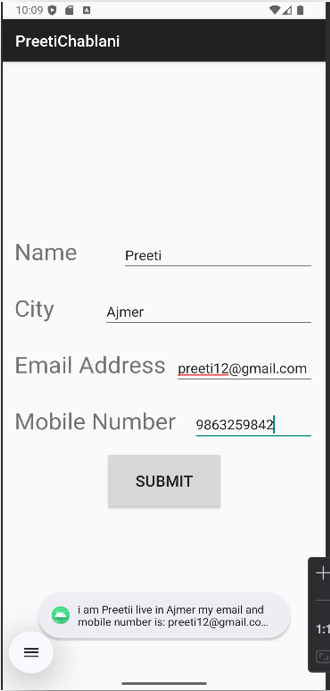
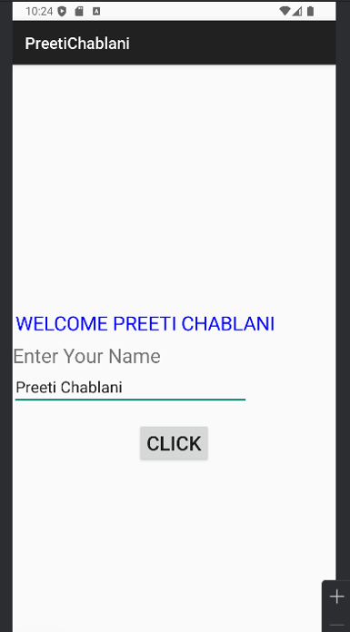
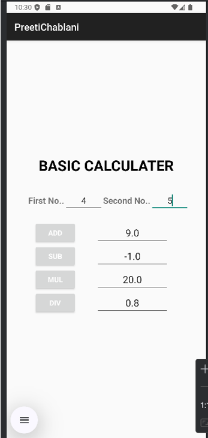
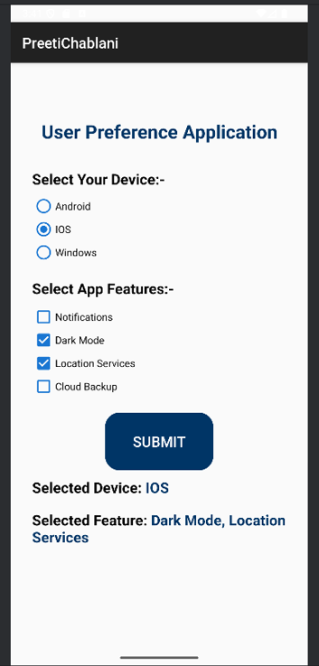
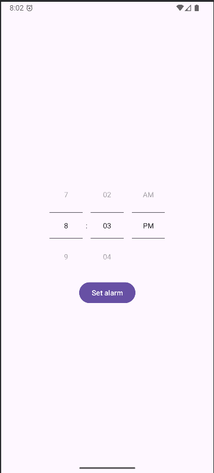

📱 Android Assignments Collection 🚀

👩‍💻 Student Details

- Name: Preeti Chablani
- Course: BCA (Bachelor of Computer Applications)
- Subject: Android Development

---

📌 Project Overview

This repository contains multiple Android assignments created for academic purposes.
These projects focus on building a strong foundation in Android development using Java and XML.

---

📂 Assignments Included 📚

🔹 Assignment 1: User Details Form 📝

- Fields: Name, City, Email, Mobile Number
- Data input using EditText
- Simple and clean UI

---

🔹 Assignment 2: Name Input App 👤

- Enter and display user name
- Basic TextView & EditText usage

---

🔹 Assignment 3: Calculator App 🧮

- Performs basic calculations
- Addition, Subtraction, Multiplication, Division
- User-friendly interface

---

🔹 Assignment 4: Radio Button & Checkbox App ✅

- Single selection using RadioButton
- Multiple selection using CheckBox
- User choice handling

---

🚀 Key Features

✨ Beginner-friendly projects,
 Clean and simple UI design,
 Covers core Android concepts,
 Easy to understand and implement

---

🛠️ Tech Stack

- ☕ Java
- 📱 Android Studio
- 🎨 XML (UI Design)

---

▶️ How to Run ⚙️

1. Open the project in Android Studio
2. Build the project
3. Run on Emulator or Physical Device

---

📸 Screenshots 🖼️

---

🎯 Learning Outcomes

✔ Understanding Android UI components
✔ Handling user inputs
✔ Working with RadioButton & CheckBox
✔ Building basic app logic (Calculator)

---

👩‍💻 Author

Preeti Chablani

---

⭐ Final 

This repository is created for educational purposes and demonstrates basic Android development concepts.
